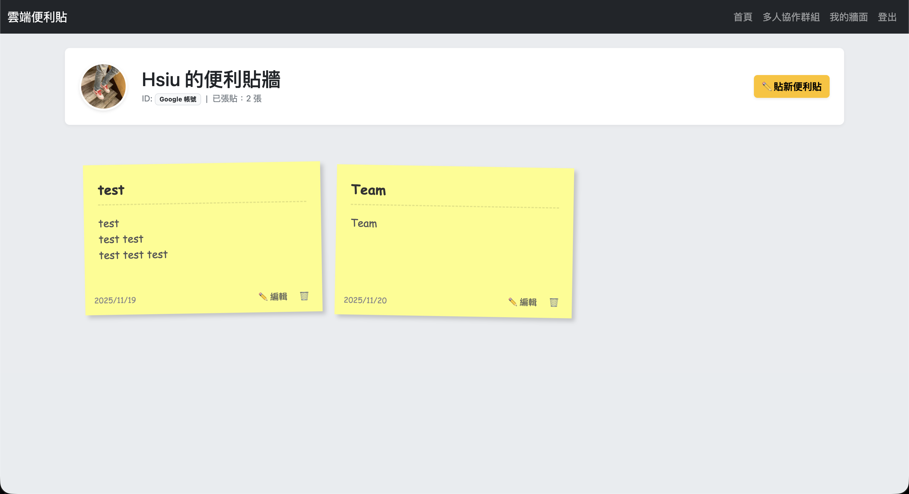
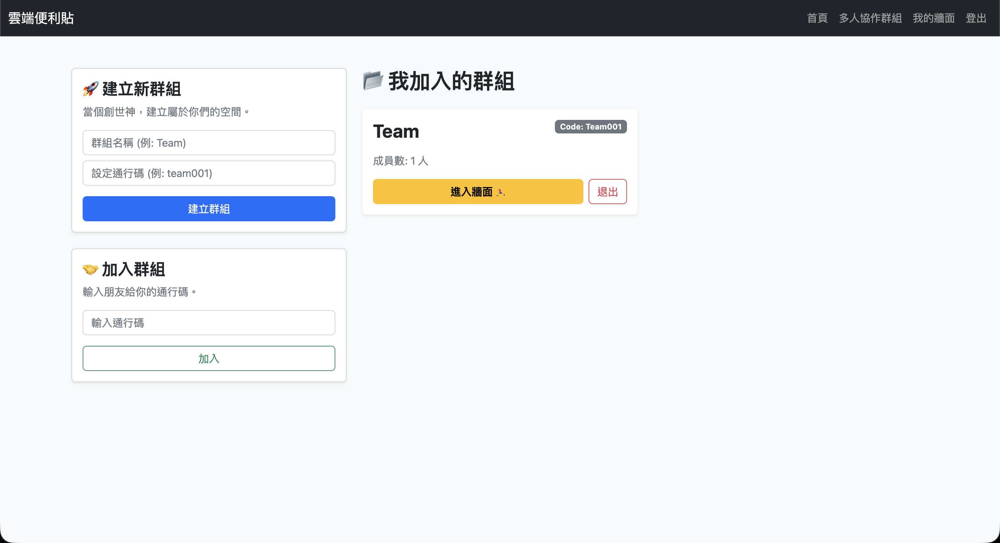
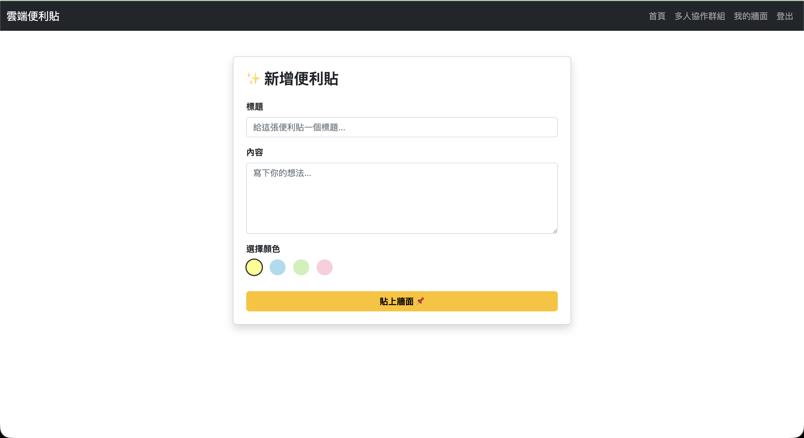
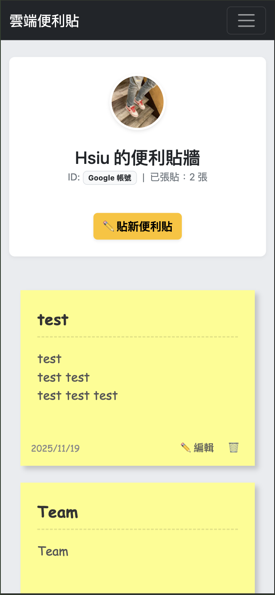
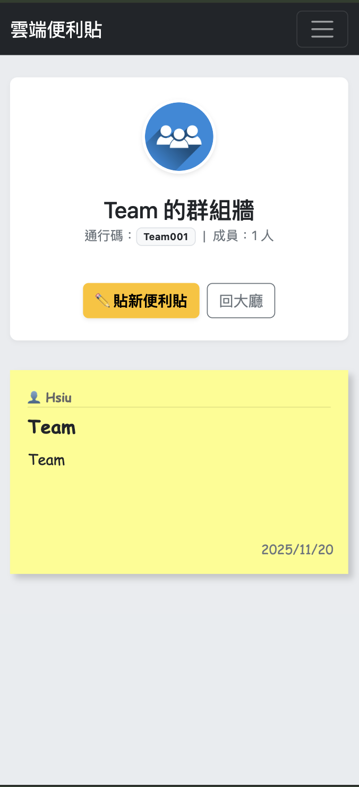

# 📝 Cloud Sticky Notes (雲端便利貼)

> 一個安全、多彩、支援個人與團隊協作的雲端便利貼應用程式。

[](https://cloud-sticky-notes.onrender.com)
[]()
[]()

## 🔗 線上體驗 (Live Demo)

**點擊這裡開始使用：** [https://cloud-sticky-notes.onrender.com](https://cloud-sticky-notes.onrender.com)

_(註：由於使用免費雲端服務，第一次開啟可能需要等待約 30-50 秒喚醒伺服器，請耐心等候。)_

---

## ✨ 功能特色 (Features)

- **🤝 多人協作群組 (New!)**：
  - 建立專屬群組牆，透過 **通行碼** 邀請朋友加入。
  - 支援多人同時在同一面牆上張貼便利貼，即時互動。
  - 自動清理機制：當最後一位成員離開時，群組與資料自動銷毀，不留痕跡。
- **🎨 多彩便利貼**：支援黃、藍、綠、粉四種顏色，讓牆面更繽紛且易於分類。
- **📱 完全響應式 (RWD)**：精心設計的介面，在手機、平板、電腦上都能完美操作。
- **🔐 雙重登入系統**：
  - **Google 快速登入**：整合 OAuth 2.0，一鍵登入免記憶密碼。
  - **本地安全註冊**：支援 Email 註冊，密碼經過 bcrypt 加密保護。
- **⚡️ 完整 CRUD 功能**：
  - **Create**: 快速新增便利貼，可選擇顏色。
  - **Read**: 視覺化的便利貼牆面展示，依時間排序。
  - **Update**: 支援編輯原本的標題、內容與更換顏色。
  - **Delete**: 刪除前會有確認彈窗，防止誤刪重要記事。
- **🛡️ 安全性與體驗優化**：
  - **環境變數保護**：敏感資訊 (API Key, DB URI) 皆透過 `.env` 管理，不外洩。
  - **404 錯誤頁面**：自訂的可愛錯誤頁面，引導使用者回首頁。
  - **路由保護**：未登入使用者無法存取個人牆面或操作資料。

---

## 🛠️ 技術堆疊 (Tech Stack)

- **前端 (Frontend)**:
  - EJS (Embedded JavaScript templates)
  - Bootstrap 5 (Responsive UI)
  - Custom CSS (Sticky Note styling & Animations)
- **後端 (Backend)**:
  - Node.js
  - Express.js (v5.0)
- **資料庫 (Database)**:
  - MongoDB Atlas (Cloud Database)
  - Mongoose ODM
- **驗證 (Authentication)**:
  - Passport.js
  - Passport-Local Strategy
  - Passport-Google-OAuth20 Strategy
- **工具 & 部署 (Tools & DevOps)**:
  - VS Code, Git
  - Render (Web Service Hosting)

---

## 📸 畫面截圖 (Screenshots)

|           首頁 (Home)           |          便利貼牆 (Wall)           |
| :-----------------------------: | :--------------------------------: |
|  |  |

|   群組大廳 (Group Lobby)    |    群組便利貼牆 (Group Wall)     |
| :-------------------------: | :------------------------------: |
|  |  |

|         編輯模式 (Edit)         |
| :-----------------------------: |
|  |

|            個人手機版 (Mobile)            |          群組手機版 (Mobile)           |
| :---------------------------------------: | :------------------------------------: |
|  |  |

---

## 🚀 本地安裝與執行 (Local Installation)

如果您想在本地端執行此專案，請依照以下步驟：

1.  **Clone 專案**

    ```bash
    git clone [https://github.com/Hsiu0308/Cloud-Sticky-Notes.git](https://github.com/Hsiu0308/Cloud-Sticky-Notes.git)
    cd Cloud-Sticky-Notes
    ```

2.  **安裝依賴套件**

    ```bash
    npm install
    ```

3.  **設定環境變數**
    請在專案根目錄建立一個名為 `.env` 的檔案，並填入以下資訊：

    ```env
    GOOGLE_CLIENT_ID=您的GoogleClientID
    GOOGLE_CLIENT_SECRET=您的GoogleClientSecret
    SESSION_SECRET=您的隨機密鑰(可隨意輸入)
    MONGODB_URI=mongodb://localhost:27017/GoogleDB
    ```

4.  **啟動伺服器**

    ```bash
    npm start
    ```

    _(或者使用 nodemon index.js)_

5.  **開啟瀏覽器**
    前往 `http://localhost:8080` 即可看到執行結果。

---

## 👤 Author

**Hensel**

- GitHub: [@Hensel🥸 Hsiu0308](https://github.com/Hsiu0308)

---

Made with ❤️ by Hensel
